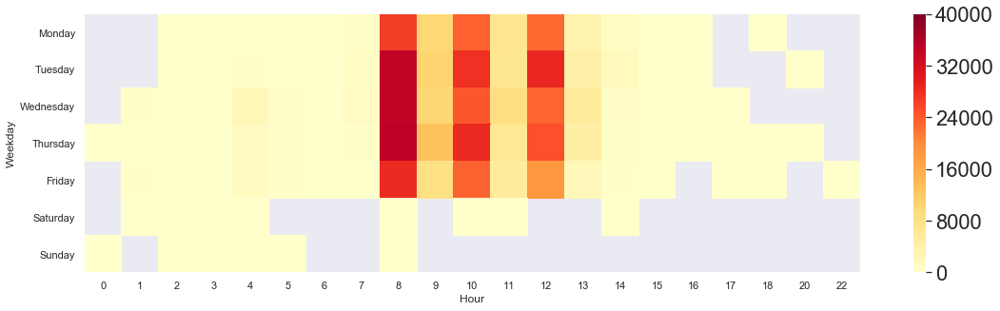
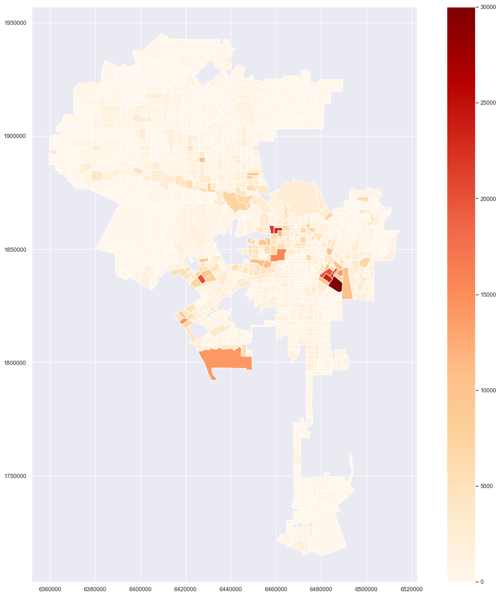
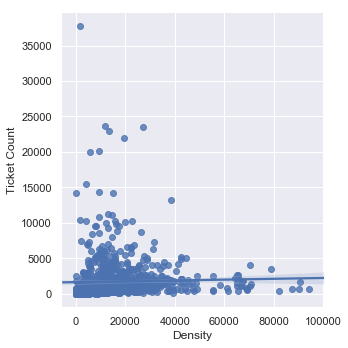

# 🅿️ Data Analytics on Parking Tickets in Los Angeles 🚗
This project explores the various trends of parking citations in the city of Los Angeles. This is a quick recap of the results. More details about the data acquisition, wrangling, cleaning, etc. can be found in the Jupyter notebook.

The parking citation data was retrieved from: https://data.lacity.org/A-Well-Run-City/Parking-Citations/wjz9-h9np

## Questions
My goal is to answer the following questions:

- Are we able to predict the number of parking tickets given in a neighbourhood based on the population density and other urban factors such as the number of homes, the number of apartments, and the walkability score?
- Is such a thing as a parking ticket quota for the agents issuing them?

## Exploratory Data Analysis

All data are from 2018

### Total number of tickets per hour during the week

### Total number numbers of tickets per day every month

### The average amount of tickets given every day

### Total number of tickets during weekdays and weekends

### Top parking violations

### When "NO PARK/STREET CLEAN" tickets are given?

### When are the other parking tickets given?

### Heatmap of the total amount of tickets given according to Zip code areas

### The number of homes and the number of tickets (Based on Zip code area)
r=-0.007

### The number of apartments and the number of tickets (Based on Zip code area)
r=0.65

### The population density and the number of tickets (Based on Zip code area)
r=0.41

### Walkability score per census tract

### Total number of tickets per census tract

### Population density per census tract

### The population density and the number of tickets (Based on census tract)

### The walkability score and the number of tickets (Based on census tract)

## Conclusion

There are no correlation between the number of tickets given and the population density. The same is for urban factors such as the number of homes, number of apartments, and the walkability score. 

Other factors that may influence the number of parking tickets would be the traffic density but this data is not available.

Another interesting aspect that we may explore would be the touristic areas.

There is no evidence that there is a parking ticket quota for the agents issuing them.

## Further actions

Although there are no correlation found between our features and the amount of parking tickets, we can advise the city of Los Angeles to enact a few changes to their parking policies such as revising their street sweeping hours, offer free parking for the displaced cars, and increase the frequency of public transit to areas that has to most tickets.
